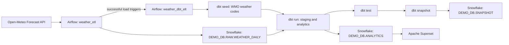

# Weather Prediction Analytics

DATA 226 Lab 1 is a weather data engineering pipeline for San Jose, California, and New York City, New York. Apache Airflow retrieves daily observations and forecast values from the Open-Meteo Forecast API, loads them into Snowflake, and starts a dbt workflow that builds analytics models and a history snapshot. Apache Superset connects to the analytics models for dashboarding.

## Architecture and Data Flow



The ETL DAG runs on a daily `02:00 UTC` schedule when unpaused. It can also be triggered manually. It fetches the configured past and forecast days for each city, transforms the API response into daily rows, and replaces the fetched `(city, date)` ranges in one Snowflake transaction. On successful load it triggers the dbt DAG without waiting for it to finish.

## Tech Stack

| Component | Purpose | Repository configuration |
|---|---|---|
| Open-Meteo Forecast API | Daily weather observations and forecasts | Called by `weather_etl` |
| Apache Airflow 2.10.1 | Scheduling and orchestration | Docker Compose service; LocalExecutor |
| PostgreSQL 13 | Airflow metadata database | Internal Compose service |
| Snowflake | Raw, analytics, and snapshot storage | Database `DEMO_DB` |
| dbt Core 1.8.7 / dbt-snowflake 1.8.1 | Models, seed, tests, and snapshot | `dbt/weather_analytics` |
| Apache Superset 6.1.0 | BI dashboard interface | Docker Compose service |
| Docker Compose | Local development stack | `docker-compose.yaml` |

## Repository Structure

| Path | Contents |
|---|---|
| `dags/weather_etl.py` | Open-Meteo extraction, transformation, transactional Snowflake load, and dbt trigger |
| `dags/weather_dbt_elt.py` | dbt seed, run, test, and snapshot tasks |
| `dbt/weather_analytics/` | dbt project, models, macros, seed, tests, and snapshot definition |
| `superset/` | Superset image, configuration, and initialization script |
| `docs/bi_dashboard.md` | Snowflake connection, dataset, chart, and dashboard setup guide |
| `keys/` | Local Snowflake key files mounted read-only into containers; excluded from Git |
| `config/` | Airflow configuration mount; currently empty in this checkout |
| `plugins/` | Airflow plugins mount; currently empty in this checkout |
| `docker-compose.yaml` | Local Airflow, PostgreSQL, and Superset services |
| `.env.example` | Names of local Compose environment settings; copy to `.env` |

## Prerequisites

- Docker Desktop (or Docker Engine) with the Docker Compose plugin.
- At least 4 GB memory, 2 CPUs, and 10 GB free disk space for the Airflow containers, as recommended by the Compose initialization script.
- A Snowflake account with access to database `DEMO_DB`, a warehouse, and a role permitted to read/write the needed raw data and create dbt objects in the `ANALYTICS` and `SNAPSHOT` schemas.
- Snowflake user/key-pair details for the Airflow connection. The repository mounts local files from `keys/` into Airflow at `/opt/airflow/keys/`.
- Network access to the Open-Meteo API.

No Open-Meteo API key is configured or required by the DAG code in this repository.

## Setup

From the repository root, create the local environment file:

```powershell
Copy-Item .env.example .env
```

Edit `.env` and replace the Superset secret key and local administrator password placeholders with unique values. The Compose file requires `SUPERSET_SECRET_KEY` and `SUPERSET_ADMIN_PASSWORD`. `AIRFLOW_UID` is set in the example file. For a non-default Airflow web user, also set `_AIRFLOW_WWW_USER_USERNAME` and `_AIRFLOW_WWW_USER_PASSWORD` in this local `.env`; otherwise Compose uses `airflow` / `airflow`.

Create or provide the Snowflake private key under `keys/` and configure its path and any passphrase in Airflow as described below. Do not add credentials or key contents to `.env.example` or other committed files.

## Airflow Configuration

### Connection

In the Airflow UI, add a Snowflake connection with connection ID `snowflake_conn`. The ETL DAG uses this connection through `SnowflakeHook`; the dbt DAG renders its values into dbt environment variables when tasks run.

| Connection field | Value |
|---|---|
| Connection ID | `snowflake_conn` |
| Connection type | Snowflake |
| Login | Your Snowflake username |
| Password | The private-key passphrase, if the key is encrypted; otherwise leave empty for key-pair authentication |
| Extra: `account` | Your Snowflake account identifier |
| Extra: `database` | `DEMO_DB` (or omit to use the configured default) |
| Extra: `warehouse` | Your Snowflake warehouse (defaults to `COMPUTE_WH`) |
| Extra: `role` | Your Snowflake role (dbt defaults to `ACCOUNTADMIN`; configure a least-privilege role where possible) |
| Extra: `private_key_file` | Container path such as `/opt/airflow/keys/snowflake_key.p8` |

The dbt configuration also supports `private_key_content` in the connection extras, but a mounted key file avoids storing key contents in Airflow metadata. The same key file is mounted read-only in Superset at `/opt/superset/keys/snowflake_key.p8` for its separately configured Snowflake connection.

### Variables

Create these Airflow Variables under **Admin → Variables**. `weather_cities` is required; other values have defaults in the DAG. City objects require `city`, `latitude`, and `longitude`; `timezone` is optional and defaults to `auto` for the API request.

| Variable | Value / default | Purpose |
|---|---|---|
| `weather_cities` | Required JSON list | City names and coordinates. The DAG validates at least two unique cities. |
| `weather_past_days` | `90` | Past days requested (Open-Meteo API limit noted in code: 92). |
| `weather_forecast_days` | `7` | Forecast days requested (API limit noted in code: 16). |
| `open_meteo_api_url` | `https://api.open-meteo.com/v1/forecast` | Open-Meteo endpoint. |
| `weather_dbt_project_dir` | `/opt/airflow/dbt/weather_analytics` | Optional dbt project path inside the Airflow container. |

Example shape for `weather_cities` (use the intended city names and coordinates):

```json
[
	{"city": "San Jose, CA", "latitude": 37.3382, "longitude": -121.8863, "timezone": "auto"},
	{"city": "New York City, NY", "latitude": 40.7128, "longitude": -74.0060, "timezone": "auto"}
]
```

These values are examples for the Airflow Variable; city configuration is not preloaded by this repository.

## Start the Stack

Build and start the Compose services from the repository root:

```powershell
docker compose up -d --build
```

| Service | Local URL / role |
|---|---|
| Airflow | [http://localhost:8081](http://localhost:8081) |
| Superset | [http://localhost:8088](http://localhost:8088) |
| PostgreSQL | Internal Compose service for Airflow metadata; no host port is published |

Airflow's default web user is `airflow` / `airflow` unless overridden with local environment values. Superset's username and password are `SUPERSET_ADMIN_USERNAME` and `SUPERSET_ADMIN_PASSWORD` from `.env` (`admin` is the configured default username). The `superset-init` service initializes its separate SQLite metadata database and creates the local administrator once.

Check service status with `docker compose ps`; view service output with `docker compose logs airflow` or `docker compose logs superset`.

## Run the Pipeline

1. Open Airflow at [http://localhost:8081](http://localhost:8081), sign in, and configure the `snowflake_conn` connection and required `weather_cities` Variable (plus any optional Variables you want to override).
2. Find DAG `weather_etl`. It is created paused by the Compose configuration. Unpause it to use its daily schedule, or use the DAG's **Trigger DAG** action to run it once.
3. The task flow is `get_cities → extract → transform → load → trigger_dbt_elt`. Extraction and transformation are mapped per city. The load replaces the fetched date window for each city in a single transaction and rolls back on failure.
4. A successful `load` triggers DAG `weather_dbt_elt`. It runs `dbt_seed → dbt_run → dbt_test → dbt_snapshot`. This DAG has no schedule of its own; it can also be triggered manually for a dbt-only rerun after raw data is available.

## Snowflake Data and dbt

| Layer | Relation | Description |
|---|---|---|
| Raw | `DEMO_DB.RAW.WEATHER_DAILY` | One row per city/date, including weather values and `is_forecast`; created and loaded by the ETL DAG. |
| Staging | `DEMO_DB.ANALYTICS.STG_WEATHER_DAILY` | dbt view that deduplicates by city/date, fills a missing mean temperature from min/max, and adds derived fields. |
| Analytics | `DEMO_DB.ANALYTICS.WEATHER_DAILY_METRICS` | dbt table with daily metrics and rolling analytics. |
| Analytics | `DEMO_DB.ANALYTICS.WEATHER_CITY_SUMMARY` | dbt table with observed-history, recent-period, and forecast summary values per city. |
| Seed | `DEMO_DB.ANALYTICS.WMO_WEATHER_CODES` | dbt seed used to add WMO weather descriptions and categories. |
| Snapshot | `DEMO_DB.SNAPSHOT.SNAPSHOT_WEATHER_DAILY` | Check-strategy history of changes to daily weather values and forecast status. |

The `weather_daily_metrics` model calculates 7-day and 30-day temperature moving averages, a temperature anomaly against the preceding 30-day baseline, 7-day and 30-day rolling precipitation, wet-day counts, and consecutive dry-spell length. The model uses a calendar spine so window sizes represent calendar days; rolling results remain null until the required window is available. A wet day is defined as precipitation of at least 1 mm.

The dbt project includes schema tests for uniqueness and non-null fields, plus custom assertions for minimum/maximum temperature consistency, rainfall consistency, city-summary coverage, and dry-spell consistency. `weather_dbt_elt` runs `dbt test` after the models and before the snapshot.

## Superset Dashboard

Superset is exposed at [http://localhost:8088](http://localhost:8088). Its metadata is stored separately from Airflow in a persistent local SQLite volume. The Snowflake connection, datasets, charts, filters, and dashboard are configured through the Superset UI; no dashboard export is present in this repository. See [the BI dashboard guide](docs/bi_dashboard.md) for the Snowflake connection settings and steps to create the datasets and dashboard.

The guide describes a `Weather Analytics Dashboard` based on `WEATHER_DAILY_METRICS`, with city and time-range filters and charts for daily mean temperature, 7-day temperature average, 7-day rolling rainfall, temperature anomaly, and dry-spell length. `WEATHER_CITY_SUMMARY` is available for city-level summary reporting.

## Security and Secrets

- Keep `.env`, private keys, passphrases, passwords, and Snowflake credentials out of Git. `.gitignore` excludes `.env`, `keys/`, key files, logs, and dbt targets; `.env.example` contains placeholders only.
- Use unique local Superset secret/admin values. Change the Compose Airflow default credentials before exposing the service beyond a trusted local environment.
- Mount the Snowflake key read-only as configured by Compose. Do not paste private-key material or passphrases into this README, dashboard documentation, or committed configuration.
- Grant only the Snowflake privileges needed for raw ingestion, dbt model/snapshot creation, and Superset read access.

## Troubleshooting

| Symptom | Check |
|---|---|
| Compose services do not become healthy | Run `docker compose ps` and inspect `docker compose logs postgres`, `docker compose logs airflow`, or `docker compose logs superset-init`. Confirm Docker has the recommended memory, CPU, and disk resources. |
| Airflow DAG fails before extraction | Confirm the `weather_cities` Variable is valid JSON with at least two unique city names and valid latitude/longitude values. |
| Snowflake authentication or load fails | Verify `snowflake_conn`, account/warehouse/role values, key path inside the container, key permissions, and passphrase. Check the task log for the Snowflake error. |
| dbt model cannot create a view/table | Confirm the configured Snowflake role can create and use required objects in `DEMO_DB.ANALYTICS` and `DEMO_DB.SNAPSHOT`, and can read `DEMO_DB.RAW.WEATHER_DAILY`. |
| Superset cannot connect or datasets are missing | Add the Snowflake connection and register the dbt datasets in Superset as described in `docs/bi_dashboard.md`; dashboard objects are not automatically provisioned. |
| Open-Meteo request fails | Check internet access, endpoint Variable, API response, and task logs. The extract task retries transient failures. |

## Future Improvements

- Add automated tests for the Python ETL transformation and transactional load behavior.
- Provision Superset database/dataset/dashboard assets as versioned configuration.
- Add forecast accuracy reporting by comparing snapshot history with observed weather.
- Improve operational alerting and document least-privilege Snowflake grants.

## Authors

DATA 226 Lab 1 project. Add the student or team member names required for submission.

## Repository Notes

- Airflow Variables and the `snowflake_conn` connection are stored in Airflow's metadata database, not checked into this repository. Set them during deployment.
- `config/` and `plugins/` are empty in this checkout. Superset dashboard setup is documented but the dashboard itself must be created in the UI.
- Existing dbt task logs record a `CREATE VIEW` privilege failure for the Snowflake role on `DEMO_DB.ANALYTICS`; verify grants for the account used before running dbt.
- The current `weather_daily_metrics.sql` source appears to contain a standalone `s` token in the calendar CTE. Review that model if `dbt_run` fails with a SQL compilation error.
- DAG and model comments still label this as “Lab 2” and refer to Tableau. The repository configuration provides a Superset dashboard, so this README follows the Lab 1 / Superset project description.
